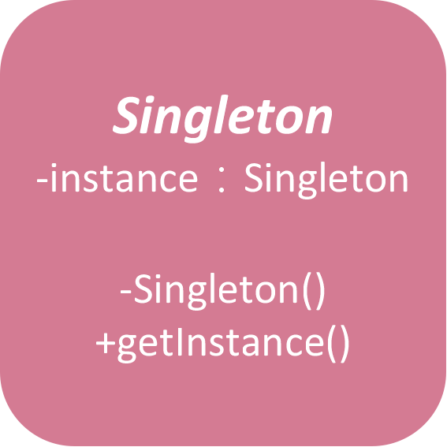

# 01 - 單例模式 ( Singleton )

定義：只有一個實例，而且自行實例化並向整個系統提供這個實例。

> 屬於創建模式，
這個模式涉及到一個單一的類別，他必須要創建自己的實例，
並且確保只有單一個對象被創建。
這個類別提供一個方法訪問其被創建的唯一一個對象。

存取ＩＯ和資料庫等資源，這時候要考慮使用單例模式。



### **有幾種方式可以實現單例模式：**

1. 懶散(Lazy)模式（線程不安全）
2. 懶散模式（線程安全）
3. 積極模式
4. 雙重鎖 (Double ChockLock)
5. 登記式（靜態內部類）
6. 枚舉 (enumeration)

### 積極單例模式

- 在宣告靜態物件的時候就已經初始化
- **優點**：在類初始時就完成實例化，避免了線程同步問題。
- **缺點**：在類裝載的時候就完成實例化，沒有達到Lazy Loading的效果。如果從始至終從未使用過這個實例，則會造成內存的浪費。

```java
package Singleton;

/**
 * 積極單例模式
 * 一開始就建立實例物件
 * @author user
 */
public class possitiveSingleton {

	// 創建lazySingleton_1私有物件
	private static possitiveSingleton instance = new possitiveSingleton();

	// 設定private建構子，因此不會被外部實例化
	private possitiveSingleton() {
	}

	// 外部獲取方法
	public static possitiveSingleton getInstance() {
		return instance;
	}

}
```

### 懶散單例模式（線程安全）

- 優點：在呼叫getInstance時才進行初始化，做到lazy loading效果
- 缺點：由於getInstance方法每次都需要同步，效率低，所以較常使用雙重鎖模式

```java
package Singleton;

public class lazySingletonSafe {
	
	// 建立私有物件
	private static lazySingletonSafe instance;
	
	// 私有建構式
	private lazySingletonSafe() {}
	
	// 整個專案都需要存取此類別，可能有多個thread同時存取
	// 添加synchronized再多線程下確保物件的唯一性
	// 但方法每次都需要進行同步，效率低
	public static synchronized lazySingletonSafe getInstance() {
		if(instance == null) {
			instance = new lazySingletonSafe();
		}
		return instance;
	}
}
```

### 雙重鎖模式

```java
package Singleton;

public class doubleCheckLock {
	public static doubleCheckLock instance;
	
	private doubleCheckLock() {};
	
	public static doubleCheckLock getInstance() {
		// 多加判斷避免不必要的同步
		if (instance == null) {
			synchronized (doubleCheckLock.class){
				
				// 第二層判斷為了在null的狀況價建立實例
				if(instance == null) {
					instance = new doubleCheckLock();
				}
			}
		}
		return instance;
	}
}
```

判斷兩次看起來有點奇怪，但其實這樣做是有原因的。

```java
instance = new Singleton();
```

上面這段程式碼看起來只有一段，但其實這句程式碼會被編譯成多條組合指令，大致上做了三件事：

1. 給Singleton的實例分配記憶體
2. 呼叫Singleton的建構函數，初始化成員欄位
3. 將instance物件指向分配的記憶體空間（此時instance不是null）

但由於Java編譯器允許失序執行，所以 2. 和 3. 的順序是無法保證的，有可能 1-2-3 也有可能 1-3-2。

如果在 3. 執行完畢、2. 還沒執行之前，切換到線程B，那instance已經不是null，此時B取走instance再使用就會出錯。

### 靜態內部類別

- 跟積極模式相同在類別內就直接建立物件實體，避免多線程的問題
- 優點：與積極模式不同，在getInstance方法被呼叫到後，才會實例化Singleton物件
- 靜態屬性只會在第一次加載類別的時候初始化，JVM幫助我們保證線程的安全性，在類別進行初始化時，別的線程是無法進入的

```java
package Singleton;

public class staticSingleton {
	
	// 一樣在類別內先建立物件實體，避免多線程的問題
	private static class SingletonHandler {
		private static final staticSingleton instance = new staticSingleton();
	}
	
	private staticSingleton(){}
	
	// 但在此類別的getInstance被呼叫到才會實例化
	public static staticSingleton getInstance() {
		return SingletonHandler.instance;
	}
}
```

[[ Day 5 ] 初探設計模式 - 單例模式 (Singleton) - iT 邦幫忙::一起幫忙解決難題，拯救 IT 人的一天](https://ithelp.ithome.com.tw/articles/10203092)

[](https://kknews.cc/zh-tw/news/yraym3a.html)
